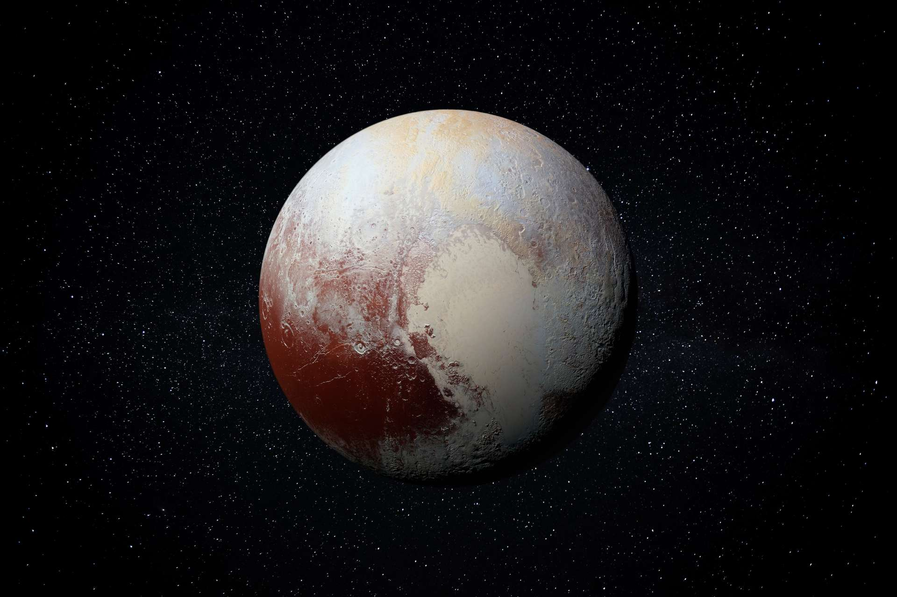

# Pluton

Pluton est la planète la plus éloigné  du soleil.

Icone créée par [monkik](https://www.flaticon.com/authors/monkik) trouvée 
sur [flaticon](https://www.flaticon.com/).

## Caractéristiques

- Masse : 1.314 x 1022 kg
- Diamètre : 2376.6 km
- Distance au soleil :
  - Aphélie : 7 x 109 km
  - Périhélie : 4.4 x 109 km
  - Demi-grand axe : 5.8 x 109 km
- Symbole : &#x2647;;

